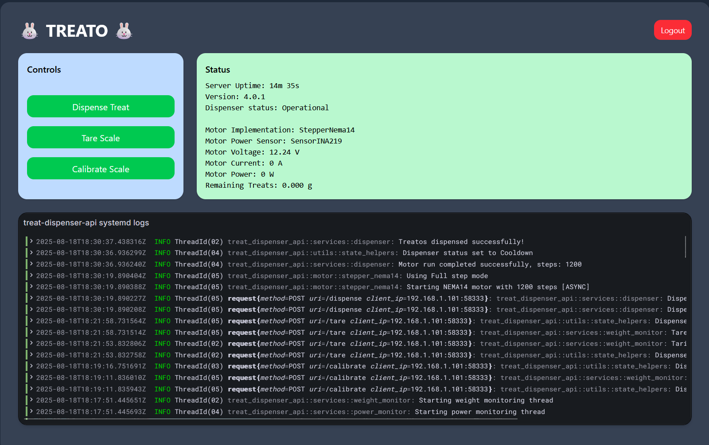

# Treat Dispenser API

A simple REST API for controlling a treat dispenser, built with [Axum](https://github.com/tokio-rs/axum) and async Rust.

## Features

- **One-click treat dispensing:** Trigger treat dispensing remotely via a simple REST API call.
- **Secure access with JWT authentication:** Only authorized users can dispense treats or access sensitive endpoints.
- **Real-time status monitoring:** Instantly check dispenser health, motor status, and uptime from any device.
- **Live power and current monitoring:** View live voltage, current, and power usage for hardware safety and diagnostics.
- **Automatic jam and error detection:** The system detects jams, high current, and hardware errors, and can cancel operations to protect the device.
- **Supports multiple stepper motors:** Easily switch between 28BYJ-48, NEMA-14, or mock motors for testing or different hardware setups.
- **Configurable cooldown and safety limits:** Prevents overheating and hardware damage with customizable cooldowns and current limits.
- **Easy setup and deployment:** Pre-built Debian packages, Docker support, and simple configuration for Raspberry Pi and other Linux devices.
- **Structured logging and diagnostics:** All actions and errors are logged for easy troubleshooting and auditability.
- **Web and mobile friendly:** Designed for integration with web frontends, mobile apps, or home automation systems.

<p align="center">
  
</p>
<p align="center"><em>Simple monitoring frontend for the treat dispenser built with React (see <code>treat-dispenser-frontend</code> for source)</em></p>

## 3D Printing

STL files for 3D printing the dispenser hardware are available in the `3d_printing` folder of this repository. These models are heavily modified and based on the original pellet dispenser designs by [jackpkenn](https://github.com/jackpkenn/PelletDispenser/tree/master). Please review and adapt as needed for your hardware setup.

## Hardware Requirements

This project is designed to work with the following hardware:

- **NEMA14 stepper motor** (with A4988 or compatible driver)
- **INA219 sensor** (for current, voltage, and power monitoring via I2C)
- **Raspberry Pi** (recommended), or any microcontroller or single-board computer with GPIO and I2C support

Ensure your hardware is compatible with the provided 3D printed parts.
Other stepper motors and sensors may be supported with code modifications by implementing the AsyncStepperMotor and PowerSensor traits (interfaces). See the Hardware Integration section for more information. 

## Quick Setup

For a quick development environment setup, run:

```bash
chmod +x setup_dev_env.sh
./setup_dev_env.sh
```

## Installation

1. **Clone the repository**

2. **Install configuration files**
   ```sh
   sudo mkdir -p /etc/treat-dispenser-api
   sudo cp config/config.yaml /etc/treat-dispenser-api/
   sudo cp config/nema14_config.yaml /etc/treat-dispenser-api/
   ```

3. **Build and install the binary**
   ```sh
   cargo build --release
   sudo cp target/release/treat-dispenser-api /usr/local/bin/
   ```

## Debian Package (Raspberry Pi, ARM64)

Pre-built `.deb` packages for Raspberry Pi (arm64) are produced by the CI pipeline and can be found in the project releases or CI artifacts (see the `dist/` directory).

### Download and Install

1. **Download the latest `.deb` package**
   - From the [GitHub Releases](https://github.com/crungo-net/treat-dispenser-api/releases) page, or
   - From your CI/CD pipeline's `dist/` artifacts

2. **Copy the package to your Raspberry Pi**
   ```sh
   scp treat-dispenser-api_*_arm64.deb pi@raspberrypi.local:~
   # or use wget/curl to download directly on the Pi
   ```

3. **Install the package**
   ```sh
   sudo dpkg -i treat-dispenser-api_*_arm64.deb
   sudo systemctl restart treat-dispenser-api
   ```

- The service will start automatically and be enabled on boot.
- Configuration files are installed to `/etc/treat-dispenser-api/`.
- Logs are available via `journalctl -u treat-dispenser-api`.

### Upgrading

To upgrade, simply install the new `.deb` package with `dpkg -i` as above. Your configuration files will be preserved unless you remove the package with `--purge`.

## Configuration

The application uses a multi-layered approach to configuration:

1. **Environment Variables**:  
   Basic configuration is loaded from environment variables or a `.env` file.  
   - `DISPENSER_JWT_SECRET`: Secret key for signing JWT tokens. Default: `supersecret` (change in production!).
   - `MOTOR_TYPE`: Type of motor to use (`Stepper28BYJ48`, `StepperNema14`, `StepperMock`). Default: `Stepper28BYJ48`.
   - `RUST_LOG`: Log level (`trace`, `debug`, `info`, `warn`, `error`). Default: `info`.

2. **Configuration File**:  
   The main configuration file is expected at `/etc/treat-dispenser-api/config.yaml` (when using the `.deb` package).  
   This file contains structured settings for the API, motor, and admin credentials.

   **Example `/etc/treat-dispenser-api/config.yaml`:**
   ```yaml
   api:
     listen_address: 0.0.0.0:3500
   nema14:
     dir_pin: 23
     step_pin: 19
     sleep_pin: 13
     reset_pin: 6
     enable_pin: 17
   motor_cooldown_ms: 5000
   admin_user: admin
   admin_password: admin123
   ```

   - `admin_user`: Default admin username (change in production!)
   - `admin_password`: Default admin password (change in production!)

3. **Application Config**:  
   The `AppConfig` struct centralizes configuration settings loaded from the config file and environment variables.

**Note:**  
- If you install via the `.deb` package, the config file must be placed at `/etc/treat-dispenser-api/config.yaml`.
- The default admin credentials are for development only. Always change these for production deployments.

## Environment Variables

| Variable              | Description                                 | Default         |
|----------------------|---------------------------------------------|-----------------|
| `DISPENSER_JWT_SECRET` | Secret key for signing JWT tokens           | `supersecret`   |
| `RUST_LOG`           | Log level (`trace`, `debug`, `info`, `warn`, `error`) | `info`          |
| `MOTOR_TYPE`         | Type of motor to use (`Stepper28BYJ48`, `StepperNema14`, `StepperMock`) | `Stepper28BYJ48` |
| `POWER_SENSOR`       | Power sensor implementation to use (`SensorINA219`, `SensorMock`) | `StepperINA219` |

Example `.env` file:
```
DISPENSER_JWT_SECRET=your_jwt_secret
RUST_LOG=info
MOTOR_TYPE=StepperNema14
POWER_SENSOR=SensorINA219
```

## Justfile Commands

This project uses [`just`](https://github.com/casey/just) as a command runner. Install `just` (if not already installed) and use the following commands for common tasks:

- **Build ARM64 binary:**
  ```sh
  just build-arm64-binary
  ```
  Builds a release binary for ARM64.

- **Build Debian package:**
  ```sh
  just build-deb-package
  ```
  Builds the ARM64 binary and then creates a `.deb` package for deployment.

- **Run tests:**
  ```sh
  just test
  ```
  Runs all tests with output shown.

- **Download latest .deb release:**
  ```sh
  just get-latest-deb-release
  ```
  Downloads the latest `.deb` package from GitHub releases into the `dist/` directory.

You can view all available commands by running:
```sh
just --list
```

## Endpoints

### `GET /`

Returns a simple status message.

**Example:**
```sh
curl http://localhost:3500/
```
_Response:_
```
Treat dispenser is online! Binky time!
```

---

### `POST /dispense`

Dispenses a treat.  
**Requires** an `Authorization` header with a bearer token.

**Example:**
```sh
curl -H "Authorization: Bearer <YOUR_TOKEN>" http://localhost:3500/dispense
```

_Response:_
- `Dispensing started, please wait...` on success
- Error message with appropriate status code on failure

---

### `POST /cancel`

Cancels an ongoing dispensing operation.  
**Requires** an `Authorization` header with a bearer token.

**Example:**
```sh
curl -H "Authorization: Bearer <YOUR_TOKEN>" http://localhost:3500/cancel
```

_Response:_
- `Dispensing cancelled successfully.` on success
- Error message with appropriate status code if there is no active dispensing operation

**Notes:**
- If dispensing is in progress, this endpoint will immediately stop the motor and set the dispenser status to `Cancelled`.
- If no dispensing is active, an error is returned.

---

### `GET /status`

Returns detailed health status information including GPIO availability, motor status, and uptime.

**Example:**
```sh
curl http://localhost:3500/status
```

_Response:_ JSON object containing system status information.

---

### `POST /login`

Authenticates a user and returns a JWT token for use with protected endpoints.

**Request Body:**
```json
{
  "username": "admin",
  "password": "admin123"
}
```

**Example:**
```sh
curl -X POST http://localhost:3500/login \
  -H "Content-Type: application/json" \
  -d '{"username": "admin", "password": "admin123"}'
```

**Response:**
```json
{
  "token": "<JWT_TOKEN>",
  "expires_at": 1725580800
}
```

- Use the returned JWT token in the `Authorization` header as `Bearer <JWT_TOKEN>` for all protected endpoints (e.g., `/dispense`, `/cancel`).
- The default credentials are set in the config file (`admin_user`, `admin_password`). Change these for production.
- The token expires 7 days after provisioning.

## Hardware Integration

The application is designed primarily for the **NEMA14 stepper motor** (with A4988 or compatible driver), offering robust and reliable dispensing performance. Default pin configuration for NEMA14 on a Raspberry Pi:

- Pin 26: Direction pin
- Pin 19: Step pin  
- Pin 13: Sleep pin
- Pin 6: Reset pin
- Pin 17: Enable pin

The NEMA14 motor:
- Has 200 steps per full rotation (1.8° per step)
- Currently supports full-step mode only
- Requires proper power supply for the A4988 driver (DC 12V 2A)

To use the NEMA14 motor, set `MOTOR_TYPE=StepperNema14` in your environment variables. The motor control logic enforces a configurable cooldown period after each dispensing operation to protect hardware (default: 5 seconds, configurable via `MOTOR_COOLDOWN_MS` or in the YAML configuration).

**Extensible Motor Support:**
Thanks to the trait-based architecture in [`src/motor`](src/motor), additional stepper motors and drivers can be supported with minimal code changes. You can add new motor implementations by following the existing trait pattern.

### 28BYJ-48 (Legacy/Secondary Support)

The application also supports the 28BYJ-48 stepper motor (with ULN2003 driver) as a secondary (and cheaper) option. Default pin configuration:

- Pin 26: Motor coil 1
- Pin 19: Motor coil 2
- Pin 13: Motor coil 3
- Pin 6: Motor coil 4

Supported step modes for 28BYJ-48:
- **Full step** (2048 steps per rotation, more torque, slower to avoid overheating)
- **Half step** (4096 steps per rotation, smoother motion)

Other step modes (quarter, eighth, sixteenth) are defined but not implemented for this motor.

### Motor Type Configuration

The motor type can be configured using the `MOTOR_TYPE` environment variable (see [Environment Variables](#environment-variables) section). This allows switching between hardware implementations and the mock implementation for testing.

## Logging

- Logs are output to stdout with thread IDs and names included.
- Log level can be set with the `RUST_LOG` environment variable (default: `info`).
- Example:  
  ```sh
  RUST_LOG=debug cargo run
  ```

## Code Structure

- `src/main.rs` – Application entry point, sets up routes, logging, server, and power monitoring thread.
- `src/lib.rs` – Library exports, app factory, and power monitoring thread starter.
- `src/application_state.rs` – Centralized application state and initialization logic.
- `src/error.rs` – Error types and HTTP response mapping.

- `src/motor/` – Stepper motor trait, real and mock implementations, and motor selection logic.
    - `mod.rs` – Motor trait and module exports
    - `stepper_28byj48.rs` – 28BYJ-48 motor implementation for ULN2003 driver
    - `stepper_nema14.rs` – NEMA-14 motor implementation for A4988 driver
    - `stepper_mock.rs` – Mock motor for testing and fallback

- `src/services/` – Business logic layer (hardware control, treat dispensing, status, authentication, etc.)
    - `mod.rs` – Exports service modules
    - `dispenser.rs` – Treat dispensing logic
    - `status.rs` – Status and health check logic
    - `auth.rs` – Authentication and JWT logic
    - `power_monitor.rs` – Power monitoring and alert logic

- `src/routes/` – API route handlers (HTTP endpoints)
    - `mod.rs` – Exports route modules
    - `dispense.rs` – Dispense endpoint handler
    - `status.rs` – Status endpoint handler
    - `auth.rs` – Login endpoint handler

- `src/middleware/` – API middleware (e.g., authentication)
    - `mod.rs` – Exports middleware modules
    - `auth.rs` – Authentication middleware

- `src/sensors/` – Sensor integration
    - `mod.rs` – Exports sensor modules
    - `sensor_ina219.rs` – INA219 power/current/voltage monitoring via I2C
    - `sensor_mock.rs` - Mock sensor implementation for testing

- `src/utils/` – Utility functions and helpers
    - `mod.rs` – Exports utility modules
    - `datetime.rs` – Date/time formatting utilities
    - `filesystem.rs` – File system operations and path handling
    - `state_helpers.rs` – State manipulation helpers

This structure separates business logic, hardware integration, HTTP interface, sensor monitoring, and utility functions for clarity and maintainability. Each module has a single responsibility, making the codebase easier to test and extend as new features are added.

## Power Monitoring (INA219 Support)

The API supports real-time power, voltage, and current monitoring using the INA219 sensor via I2C:

- **INA219 Integration:**
  - Implemented in `src/sensors/sensor_ina219.rs` and exposed via `src/sensors/mod.rs`.
  - Uses the [`ina219`](https://crates.io/crates/ina219) crate and `linux-embedded-hal` for I2C communication.
  - Initializes the sensor on `/dev/i2c-1` (default address `0x40`).
  - Calibrates for 1A resolution and 0.1Ω shunt resistor (configurable in code).
  - Provides bus voltage, current, and calculated power readings.

- **Power Monitoring Logic:**
  - The `PowerMonitor` struct in `src/services/power_monitor.rs` collects and averages power readings.
  - The monitoring thread is started by calling `start_power_monitoring_thread` (now located in `src/services/power_monitor.rs`).
  - The thread polls the INA219 sensor every 100ms, adds readings to the monitor, and publishes them to the application state via a broadcast channel.
  - If the average current exceeds a threshold (default: 0.7A), the thread will log a warning and cancel ongoing motor operations for safety.
  - Readings are periodically cleared to avoid unbounded memory growth.

- **API Exposure:**
  - Power readings are published to the application state and exposed via the `/status` endpoint.
  - Status response includes:
    - `motor_voltage_volts`
    - `motor_current_amps`
    - `motor_power_watts`
  - If the sensor is unavailable, dummy values are returned and errors are logged.

- **Error Handling:**
  - Initialization and read errors are logged.
  - Sensor failures do not crash the API; fallback values are used.

**Example INA219 YAML config:**
```yaml
power_monitor:
  i2c_bus: /dev/i2c-1
  address: 0x40
  shunt_ohms: 0.1
  calibration_amps: 1.0
```
*(Note: Actual config is currently hardcoded and yaml support will be added in future releases; see `sensors/sensor_ina219.rs` and `services/power_monitor.rs` for details.)*

## Testing

The project includes both unit tests and integration tests:

### Unit Tests

Run unit tests with:
```sh
cargo test --lib
```

Unit tests cover individual components like date formatting utilities, motor control logic, and error handling.

### Integration Tests

Run integration tests with:
```sh
cargo test --test integration
```

Integration tests verify the full API functionality by starting a test server and making HTTP requests to the endpoints.

For better test parallelism, tests that require sequential execution (like testing busy states) are grouped together in single test functions.

## Continuous Integration (CI)

This project uses a GitLab CI pipeline (see `.gitlab-ci.yml`) to automate testing, building, packaging, and releasing for multiple architectures.

**Key pipeline stages:**

- **Test:**
  - Runs all tests (`cargo test --all --locked --release`) on every branch push.

- **Build:**
  - `build-amd64-binary-and-image`: Builds the x86_64 (amd64) binary and Docker image using BuildKit, pushes images to the private registry (`harbor.crungo.net`), and saves the binary as an artifact.
  - `build-arm64-binary`: Builds the ARM64 binary (`aarch64-unknown-linux-musl`) and saves it as an artifact.
  - `build-deb-package`: Creates a `.deb` package for ARM64 using the prebuilt binary and saves it as an artifact.

- **Tag:**
  - `tag-release`: (Manual, on `main` branch) Tags the commit with the version from `Cargo.toml` and pushes the tag to the repository.

- **Fetch:**
  - `fetch-artifacts-for-tag`: Fetches build artifacts for a release tag using the GitLab CLI, ensuring all necessary files are available for deployment.

- **Deploy:**
  - `release-github`: Publishes the binaries and `.deb` package to GitHub Releases, generating a changelog from commit history.

**Artifacts:**
- Built binaries (`dist/treat-dispenser-api-amd64`, `dist/treat-dispenser-api-aarch64`) and `.deb` packages are saved as CI artifacts for one week and are used in the release process.

**Image Tags:**
- Docker images are tagged with `latest`, the short commit SHA, and the branch name for traceability.

**Authentication:**
- Docker credentials are injected for pushing to the private registry (`harbor.crungo.net`).
- GitHub and GitLab tokens are used for release automation.

**Multi-Arch Support:**
- Both x86_64 and ARM64 binaries and images are built and published, supporting a wide range of deployment targets.

**Debian Packages:**
- The pipeline produces `.deb` packages for ARM64, suitable for Raspberry Pi and similar devices. These are available as artifacts and in GitHub Releases.

See the `.gitlab-ci.yml` file for full details and customization options.

## GitLab and GitHub: Why Both?

This project is maintained in both a private self-hosted GitLab repository and a public GitHub repository. The primary reason for this dual setup is to leverage private build infrastructure:

- **Private Docker Registry:** Container images are built and pushed to a secure, self-hosted Docker registry for internal deployments.
- **Kubernetes Runners:** CI/CD pipelines use private Kubernetes runners for builds and deployments.
- **Confidential Artifacts:** Some build artifacts and deployment configurations are kept private for security and operational reasons.

The public GitHub repository is used for open-source collaboration, issue tracking, and public releases, while the private GitLab instance handles sensitive infrastructure and deployment automation.

**Repository Mirroring:**
GitLab is configured to automatically mirror (push) all changes to GitHub using its built-in repository mirroring feature. This ensures that the public GitHub repository stays up to date with the latest changes from the private GitLab source.

## License

MIT


